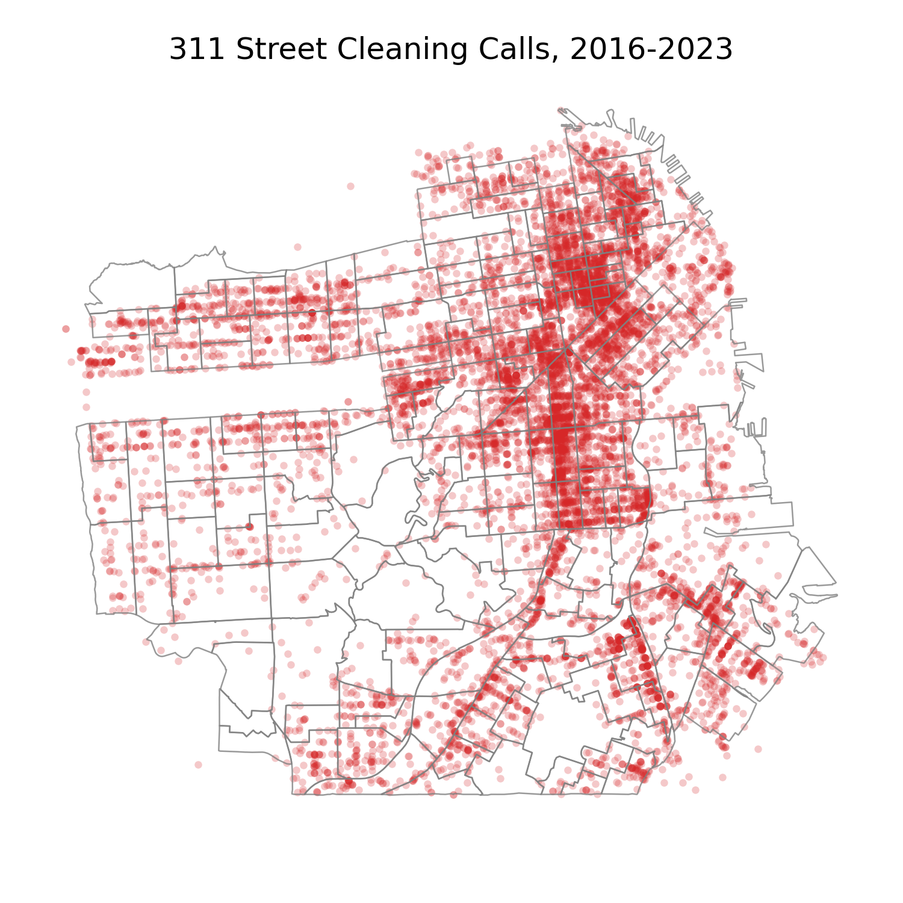

# San-Francisco-Service-Analysis

## Project Title: Forecasting and Inference for Public Sector service provisioning

**Team Members**: Peter Amerkhanian, Jared Schober


## Instructions

- Run `long_run_ARIMA.py` for output of all long-run ARIMA forecasting results (~3 hours). This script will use `public_data/processed_data.csv`
- Run `Non_ARIMA_Models.py` for output of all next-hour and long-run models besides ARIMA (~4 hours). This script will use `public_data/processed_data.csv`
- Run `Geospatial_Models.py` for output of OLS and Random Forest Next-Hour models applied at the census tract level. This script will download the 311 data directly and requires an internet connection.

Presentations and final paper are in `Written Materials`.

**Datasets**:
- SF 311 calls for service (2008-2023)
  - n=2.28 million 
  - Geo-spatial distribution: </img>

## WORKFLOW

```
git pull
# start working
git add .
git commit -m "your message here"
git push
```

## Project Description:
We seek to forecast the hourly need for street cleaning services in San Francisco, so that the city can more accurately prepare for service delivery. We will use the data as a time series and will aim to produce forecasts that are accurate at one week.  


