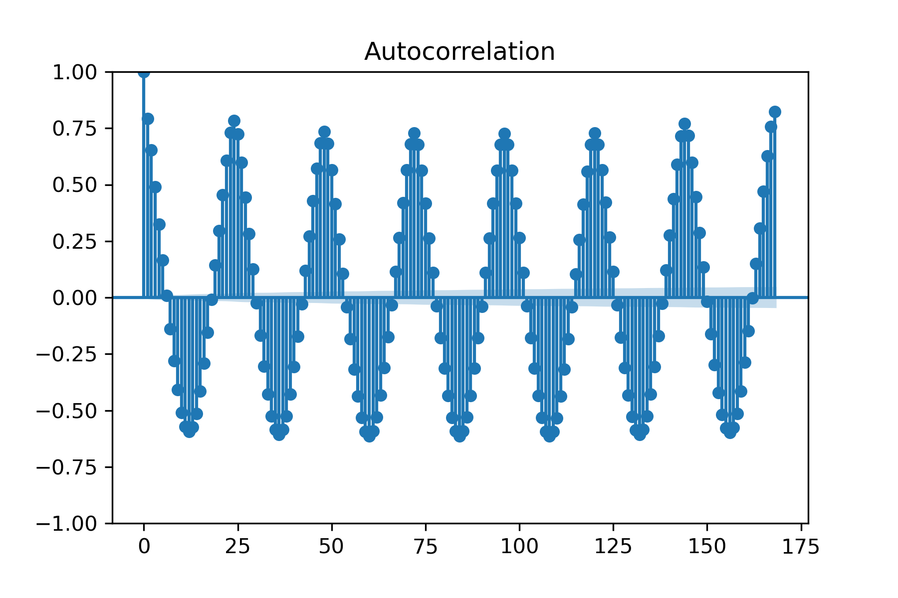

# San-Francisco-Service-Analysis

## Project Title: Forecasting and Inference for Public Sector service provisioning

**Team Members**: Peter Amerkhanian, Jared Schober

**Datasets**:
- SF 311 calls for service (2008-2023)
  - n=2.28 million 
  - Geo-spatial distribution: </img>
- Daily Weather (2015-2023)
  - *We haven't downloaded this yet*
- Census American Community Survey (2015-2023) at the census tract level
  - We have successfully spatially merged every call's coordinate (longitude, latitude) with their parent census tract and its accompanying demographic profile.

## Questions
- Project title / Motivation
- Data details:
- Summary statistics
- Challenges
- Data augmentation ( if planned)
- EDA / Data preprocessing ( if done)
- ML pipeline setup
- Train test split
- Choice of models and baselines
- Evaluation metrics
- Plan for the rest of the project and task distributions
- Any misc item that you want to discuss
## WORKFLOW

```
git pull
# start working
git add .
git commit -m "your message here"
git push
```

## Project Description:
We seek to forecast the hourly need for street cleaning services in San Francisco, so that the city can more accurately prepare for service delivery. We will use the data as a time series and will aim to produce forecasts that are accurate at one week.  

We will also examine how the per-capita quantity of street cleaning services delivered to different neighborhoods varies with respect to neighborhood characteristics (namely income and racial demographics). By extension, we will be able to see if our forecasting system has the risk of automating in-equitable service delivery patterns.


## Methods:
### Inference
- We will be interested in how various neighborhood level socio-demographic factors covary with calls per capita. For example, in examining how racial demographics covary with calls, we would specify the following:  
$(\frac{\text{311 Call Count}}{\text{Population}})_n = \beta_0 + \beta_1(\text{Percent Nonwhite}_n) + \epsilon$  

- We will examine model features, such as $R^2$, the magnitude of $\beta_1$, etc., to gauge the social equity of current service allocation. With this in mind, we will have an idea of whether our forecasting models may scale inequity.
### Forecasting
- ARIMA
- Recurrent Neural Network

These models will be purely trained on time lags of the output (call count) and on time lags of weather.  

**Train-test splits** will be made with time-series structure in mind.  

**Baseline prediction** will be predicting the amount of calls that occurred the year before on any given date:  
$\hat{Calls_{y, m, d}} = Calls_{y-1, m, d}$  
(Where y=year, m=month, d=day)

All models will be **evaluated according to their Root Mean Square Error**, given that we have a more or less continuous output.

## Methodological questions:
- Will deep learning outperform ARIMA for this task?
- Is deep learning necessary for achieving our goal? 
- Taken uncritically, would implementation of our winning forecasting model increase/maintain any inequities in service delivery patterns?

## Deliverables:
- Phase 1 (by April 15th): Data gathered from various sources into a single dataset, imputation of missing data, feature engineering, exploratory data analysis
- Phase 2 (by May 3rd): Forecasting models trained (regression, gradient boosting, neural network), inference conducted, writeup completed

## Preliminary ARIMA results:
 </img>
